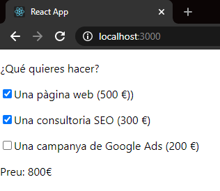
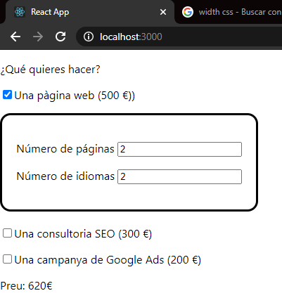
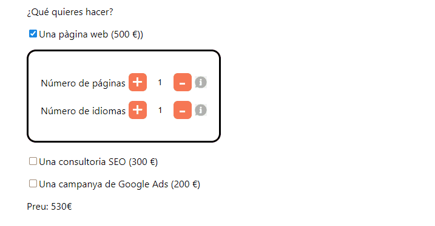
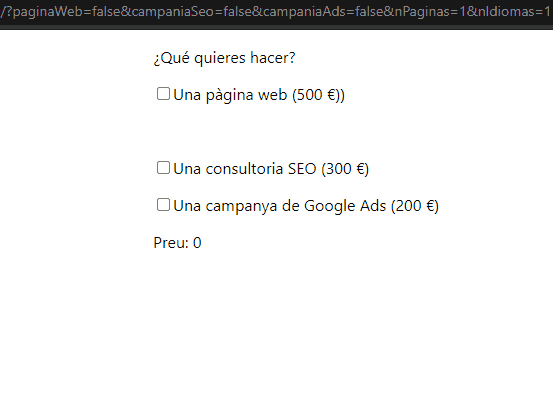

# Sprint 7. Vue II

##### Sumari

- Descripció i Objectius

- Part teòrica
  
  - Curs Vue. Part 2.
  
  - Vue debugging.
  
  - A practicar!

- Part pràctica. S7. Pressupost.

# Descripció i Objectius

En aquest sprint acabaràs de conèixer els conceptes fonamentals de Vue que no ha donat temps a veure en l'anterior apartat.

##### **Durada de l'sprint**

15 dies lectius.

##### **Objectiu general**

- Aprendre conceptes bàsics i intermedis de Vue.

##### **Objectius específics**

- Entendre què són els mètodes de cicle de vida aprendre a utilitzar-los.
- Saber implementar watchers.
- Implementar el routing de Vue.
- Crear formularis amb Vue.
- Aprendre les directives de Vue.
- Debugar una aplicació Vue per detectar errors.
- Agregar i fer servir Bootstrap i Tailwind CSS.
- Aprendre a fer servir els slots de Vue.
- Consumir dades d'una API amb Axios.
- Aprofundir en la reactivitat de Vue.

---

# PART TEÒRICA

## Curs Vue, part 2

  

En el següent apartat treballaràs els conceptes més avançats de Vue.

És molt important que sàpigues comprendre correctament (en l'àmbit tècnic) les documentacions d'aquelles tecnologies amb les quals et familiaritzes habitualment.

En cada sprint estàs aprenent elements i aspectes nous, per aquest motiu et recomanem acudir a la **->[**documentació oficial de Vue**](https://v3.vuejs.org/guide/introduction.html#what-is-vue-js)** regularment perquè puguis repassar els conceptes i no t'oblidis de les seves característiques rellevants.

A més, la documentació oficial de Vue està molt ben estructurada, amb explicacions molt clares i concises!

### Cicle de vida dels components

En **Vue**, cada component té un cicle de vida, una quantitat d'etapes diferents que travessa.

Podem utilitzar aquests esdeveniments en diferents fases de la nostra aplicació per obtenir el control dels components:

[#06 Ciclo de vida de Vue (Lifecycle) | Curso de Vue.js 😍 Desde Cero - YouTube](https://www.youtube.com/watch?v=2VZBZuHOtIA)

### Watchers

Els **watchers** de Vue.js ens permeten executar una funció cada vegada que una propietat del nostre component modifiqui el seu valor:  

Si les propietats computades són més apropiades en la majoria dels casos, els **watchers** són més poderosos i ens permeten fer operacions complexes, com per exemple: les anomenades **http** o executar alguna lògica asíncrona (que no seria possible amb una propietat computada).

[watchers vue //🎓Curso de vuejs GRATIS// (17) Propiedades observadas (Watchers) - YouTube](https://www.youtube.com/watch?v=qD0pcT0xWb0)

### Formularis en Vue

Els formularis són una part molt important de qualsevol web, ja que normalment hem de demanar dades a l'usuari, com per exemple pot passar amb el **login i el registre.**

A continuació, et presentem un recurs molt complet perquè aprenguis a crear qualsevol mena de formulari en Vue.

[Vue JS 3 Tutorial for Beginners #7 - Forms &amp; Inputs - YouTube](https://www.youtube.com/watch?v=ixOcve5PX-Q)

### Routing

Totes les vistes (components) de la nostra app es mostren sobre l'índex, intercanviant el component que es visualitza en cada acció, però sense recarregar la pàgina **SPA (Single Page Action).** 

Per tant, en Vue existeix el **Sistema de Routing**, l'objectiu del qual és permetre que en la nostra app hi hagi rutes internes i la navegació.

El Routing és el responsable de reconèixer la ruta que l'usuari vol visualitzar a cada moment:

[#18 Rutas con Vue (router-view) | Curso de Vue.js 😍 Desde Cero - YouTube](https://www.youtube.com/watch?v=vHC5ByLBi0k)

[#19 Router Link y Rutas con Parámetros | Curso de Vue.js 😍 Desde Cero - YouTube](https://www.youtube.com/watch?v=ImKHslGDJhQ)

[#20 Parámetros dinámicos y rutas a través de eventos | Curso de Vue.js 😍 Desde Cero - YouTube](https://www.youtube.com/watch?v=YY219kmA54A)

### Query Params en Router-Link

A vegades, volem afegir paràmetres de consulta als URL de ruta i que els components siguin capaços d'obtenir els paràmetres d'aquesta ruta:

[VUE JS | Cómo configurar Query Params en Router-Link - YouTube](https://www.youtube.com/watch?v=6fUl-AnVxx0)

### Bootstrap & Vue

Bootstrap et permetrà crear llocs web **responsive** fàcilment. 

A continuació, et presentem una sèrie de vídeos que expliquen diversos temes fonamentals sobre Bootstrap implementat en Vue:

[#21 Bootstrap 4 + Vue [Instalación] | Curso de Vue.js 😍 Desde Cero - YouTube](https://www.youtube.com/watch?v=sMZZuM4tavo)

[#22 Navbar [Class Active] Bootstrap 4 + Vue | Curso de Vue.js 😍 Desde Cero - YouTube](https://www.youtube.com/watch?v=qoE6pTHv5eg)

[#23 Columnas responsives [Row/Col] Bootstrap 4 + Vue | Curso de Vue.js 😍 Desde Cero - YouTube](https://www.youtube.com/watch?v=WPlOlF3lWK0)

[#24 Botones y Cards con Bootstrap 4 + Vue | Curso de Vue.js 😍 Desde Cero - YouTube](https://www.youtube.com/watch?v=U_tHCLMTiFI)

[#25 Formulario INPUT con Bootstrap 4 + Vue | Curso de Vue.js 😍 Desde Cero - YouTube](https://www.youtube.com/watch?v=Z1LxWfjjdfU)

[#26 Formulario Select y Radio Buttons con Bootstrap 4 + Vue | Curso de Vue.js 😍 Desde Cero - YouTube](https://www.youtube.com/watch?v=iGGm_piFwoY)

### Tailwind & Vue

És un framework CSS que s'ha posat de moda recentment.

**VIGILA!** Ja que, en les ofertes d'ocupació apareix més sovint el Bootstrap que Tailwind!

Bé, en el cas que Bootstrap no t'hagi convençut del tot o simplement t'interessa aprofundir en la maquetació web, a continuació, et presentem un vídeo que ensenya a utilitzar Tailwind amb Vue:

[Tailwind CSS with Vue - YouTube](https://www.youtube.com/watch?v=ZAjUGkhqUP4)

### Consumir dades d'una API amb Axios

Aquesta part és fonamental, ja que, la majoria de les aplicacions web que hauràs de desenvolupar han de carregar dades a través d'un o diversos servidors externs.

A continuació, et presentem el següent vídeo que explica com utilitzar **Axios** per obtenir dades d'una **API.**

[| Vue desde 0 | Usando Axios para traer datos de una API #7 - YouTube](https://www.youtube.com/watch?v=0Ti9d524lNQ)

Estigues atent/a a aquesta part, perquè saber com consumir dades en una aplicació de Vue és essencial.  

El següent vídeo detalla com fer servir el concepte **fetch** en lloc d**'Axios**. Principalment, la diferència és que s'usen promeses i fa ús d'un paquet anomenat **Json-server**, que permet simular una API en el nostre ordinador.   

Json-server et pot ser útil a l'hora de resoldre una prova tècnica en una empresa, ja que queda molt millor que posar les variables hardcodeadas en un component o carregar un Json en local:

[Vue JS 3 Tutorial for Beginners #9 - Fetching Data - YouTube](https://www.youtube.com/watch?v=7iDGJolHFmU)

### Reactivitat en Vue

Una de les característiques que diferencien a Vue és el seu sistema de reactivitat. És important entendre com funciona per poder prevenir alguns errors comuns. 

En aquesta secció, indagarem en alguns detalls de baix nivell del sistema de reactivitat de Vue.

A més,  escoltar una xerrada d'un expert, observant els seus mètodes de programació i resolent dubtes, pot ser molt beneficiós pel teu aprenentatge amb Vue. 

T'aconsellem que ho facis!

[¿Cómo funciona la reactividad en VueJS? Implementando un sistema reactivo desde cero | T3chFest 2019 - YouTube](https://www.youtube.com/watch?v=axXwWU-L7RM)

## VUE DEBUGGING

### Vue Debug en VSCode

A vegades és més com posar els **breakpoints** en VSCode en lloc del browser, el següent vídeo et mostra com fer-ho:

[3 Ways To Debug Your Vuejs Apps With VS Code And Chrome - YouTube](https://www.youtube.com/watch?v=lyGt1TmleoU)

### Vue DevTools

**Vue DevTool** és una extensió per a navegadors Google Chrome o Firefox, útil per perfilar i depurar aplicacions desenvolupades amb Vue:

[Vue DevTools (Curso Vue.js ) - YouTube](https://www.youtube.com/watch?v=wBtNNomNGVc)

---

# PART PRÀCTICA - S7. PRESSUPOST

### Objectius

- Practicar els mètodes de clicle de vida.

- Utilitzar rutes de Vue.  

- Filtres i cercador sobre llistats.

### Descripció

**En aquest lliurament realitzarem una aplicació amb el fi de facilitar els càlculs del pressupost d'una pàgina web,** afegint més interaccions amb l'usuari/ària respecte a la pràctica anterior (caselles de selecció, inputs, botons). 

La web haurà de reaccionar i modificar el preu total en funció de les opcions escollides per l'usuari/ària.  

##### Notes

Aquestes indicacions són del responsable de front - end:  

- S'ha de crear la base del projecte sobre la qual treballar usant Vue-cli.

- **Està prohibit copiar el codi**, ja que d'aquesta manera no s'aprèn res. A més,  el segon lliurament de l'sprint 9 és una prova de nivell amb el mentor, en la qual hauràs de demostrar que has adquirit els conceptes necessaris de Vue. 

D'altra banda,  si has fet tots els lliuraments de les tasques, no has de tenir problemes per aprovar la prova. Ànims!

## Nivell 1

### - Exercici 1

L'aplicació començarà amb tres checkboxes. D'aquesta manera,  l'usuari/ària haurà de decidir una de les següents opcions plantejades davant d'aquest cas real:  

1- Obtenir el pressupost d'una pàgina web (500 €). 

2- Fer una campanya SEO (300 €). 

3- Fer una campanya de publicitat (200 €).

En funció de les opcions que marqui, es mostrarà un preu diferent.

  

Implementa aquesta lògica en el component principal "Home", que haurà d'indicar-se com a ruta inicial en el **routing**. 

Simplement, hauràs de **crear 3 caselles de selecció que executin una funció**, per després traspassar aquesta funció a l'esdeveniment de la casella de selecció. D'aquesta manera, podrem ser conscients de quina casella de selecció s'ha fet servir. Finalment, seguint el fil de l'última tasca**, recorda que hauràs de modificar el preu total.** 

**Ajuda:** pots guardar la situació de cada casella de selecció en variables diferents per calcular el total o bé, pots crear una única variable en format array que et permetrà centralitzar la situació de les tres caselles de selecció.  

També convé guardar el pressupost total calculat en una variable.

### - Exercici 2

Una vegada creades les caselles de selecció que permeten a l'usuari/ària seleccionar el tipus de servei que necessita, li oferirem l'opció **d'ajustar un dels serveis: crear una pàgina web que sigui capaç de modificar el nombre de pàgines i d'idiomes.**

Per això, cal definir un component Panell, el qual serà visible i ajudarà al client/a prendre decisions més fiables respecte a la seva pàgina web.

Respecte al cost total de la web, haurem d'afegir la següent quantitat:

**-  (Nombre de pàgines * el nombre d'idiomes * 30) €.**

  

Aquest component Panell serà fill del component Home, però en lloc d'implementar la lògica de negoci (fórmula del cost en funció del nombre de pàgines i idiomes en Panell), **hauràs de crear un servei que calculi el pressupost total.**

### - Exercici 3

GENIAL!, l'usuari/ària ja pot demanar 3 dels nostres serveis i personalitzar un d'ells. 

Per facilitar el procediment a l'usuari/ària, crearem una sèrie **botons** situats al costat de l'input **perquè pugui modificar la seva selecció d'una manera més pràctica i innovadora,** com per exemple: escriure en un text la quantitat desitjada (d'aquesta manera, s'estalviarà teclejar el nombre de pàgines i idiomes necessaris).

Per fer-ho, hauràs de canviar els *<input type = "text" />* del panell per un nou component més ajustat i versàtil, que s'adeqüi als requisits que hem mencionat anteriorment.

  

 

### - Exercici 4

Per finalitzar aquesta primera fase del projecte, és necessari **implementar una pantalla de benvinguda a l'usuari/ària** que visualitzi clarament el propòsit i funcionament de la web.

Clicant un botó se't mostrarà el component Home amb la calculadora de pressupostos (també ha d'haver-hi un botó que permeti tornar enrere).

D'altra banda, és necessari que implementis la navegació entre vistes utilitzant el routing de Vue.

## Nivell 2

### - Exercici 5

Sempre hi ha usuaris/àries despistats/es que podran usar la teva web de pressupostos. Per garantir que tothom entén el significat dels inputs del nombre de pàgines i d'idiomes, hauràs d'implementar un botó que obri un **popup** d'ajuda.

Mostrar el missatge d'ajuda amb els **modals de Bootstrap**, sent el botó que facilita una icona d'informació:  

  

 **Per saber més**

sobre els modals en Bootstrap Vue. **->[Modal | Components | BootstrapVue](https://bootstrap-vue.org/docs/components/modal)**

### - Exercici 6

Ja has completat la web, però només funciona per a fer un únic pressupost. Com aquesta web està pensada perquè també els programadors/es freelance puguin generar els seus pressupostos, **falta oferir aquesta opció als usuaris/àries** perquè puguin generar **diversos pressupostos.**

Per això, hauràs d'afegir dos **inputs**: nom de pressupost i client, que juntament amb el servei seleccionat per l'usuari/ària i el preu total calculat,  també serà necessari un llistat de pressupostos en la part dreta de la pantalla.

#### Requeriments:

- El llistat dels pressupostos no s'ha de renderitzar directament en el component Home amb un **v-for**, cal crear un nou component (**pressupostList** per exemple), que guardi el llistat de pressupost per **props** i s'encarregui de renderitzar-los.

### - Exercici 7

Hi ha un problema amb el llistat de pressupostos! Costa trobar els pressupostos quan hi ha molts, ja que no existeix cap mena de filtre, cercador o opció per ordenar el llistat.

En aquest exercici hauràs d'implementar 3 botons en la part superior del llistat, els quals efectuen les següents tasques:

**- Botó d'ordenar alfabèticament els pressupostos.**

**- Botó d'ordenar per data els pressupostos.**

**- Botó de reinicialitzar l'ordre.**

### - Exercici 8

Ordenant els pressupostos gràcies a l'exercici anterior, facilita i potencia les funcionalitats de la web. Tanmateix, existeixen més opcions per millorar i extreure més beneficis.

Es necessita implementar un **cercador de pressupostos,** per facilitar la recerca de tots els **noms** guardats i així, ser conscient dels que concorden.

## Nivell 3

### - Exercici 9

Per finalitzar, és imprescindible oferir a l'usuari/ària la capacitat de compartir l'URL d'un pressupost perquè d'aquesta manera, el receptor/a pugui visualitzar la pantalla emplenada. En moltes ocasions un servei es contracta per recomanació, per aquesta raó és fonamental tenir-lo implementat.

Seleccionant cadascuna de les opcions del pressupost, la mateixa URL ha de canviar en funció d'aquests canvis. D'aquesta manera, si el client comparteix l'URL amb algú, aquest podrà visualitzar les mateixes opcions del pressupost.

---

## Criteris de qualificació

Rubrica exercici M2. Classes & Arrow Functions 

Exercici 1 (N.1) En funció de les opcions que marqui, es mostrarà un preu diferent.

|                           |                                                                       |                                                          |
| ------------------------- | --------------------------------------------------------------------- | -------------------------------------------------------- |
| No funciona  0punts | Funciona sense ser implementada com l'enunciat indica  0.5punts | Funciona amb la implementació sol·licitada  1punts |

Exercici 2 (N.1) Al cost total del web haurem d'afegir els següents valors: - Quantitat de pàgines * la quantitat d'idiomes * 30 €.

|                           |                                                                       |                                                          |
| ------------------------- | --------------------------------------------------------------------- | -------------------------------------------------------- |
| No funciona  0punts | Funciona sense ser implementada com l'enunciat indica  0.5punts | Funciona amb la implementació sol·licitada  1punts |

Exercici 3 (N.1) Afegir botons als costats dels inputs per decrementar o incrementar els valors (pàgines i idiomes),

|                           |                                                                       |                                                          |
| ------------------------- | --------------------------------------------------------------------- | -------------------------------------------------------- |
| No funciona  0punts | Funciona sense ser implementada com l'enunciat indica  0.5punts | Funciona amb la implementació sol·licitada  1punts |

Exercici 4 (N.1) Implementar una pantalla de benvinguda a l'usuari / navegació entre vistes (utilitzant el Routing de Vue)

|                           |                                                                       |                                                          |
| ------------------------- | --------------------------------------------------------------------- | -------------------------------------------------------- |
| No funciona  0punts | Funciona sense ser implementada com l'enunciat indica  0.5punts | Funciona amb la implementació sol·licitada  1punts |

Exercici 5 (N.2) Mostrar dos popups d'informació (modals de Bootstrap)

|                           |                                                                       |                                                          |
| ------------------------- | --------------------------------------------------------------------- | -------------------------------------------------------- |
| No funciona  0punts | Funciona sense ser implementada com l'enunciat indica  0.5punts | Funciona amb la implementació sol·licitada  1punts |

Exercici 6 (N.2) Afegir dos inputs més (mostrant-los amb un v-for en un nou component amb l'enviament de les dades utilitzant Props).

|                           |                                                                       |                                                            |
| ------------------------- | --------------------------------------------------------------------- | ---------------------------------------------------------- |
| No funciona  0punts | Funciona sense ser implementada com l'enunciat indica  0.4punts | Funciona amb la implementació sol·licitada  0.8punts |

Exercici 6 (N.2) Només s'afegeixen els pressuposts on l'usuari ha escrit tots els valors i tenen un import més gran de 0€

|                           |                                                                     |                                                          |
| ------------------------- | ------------------------------------------------------------------- | -------------------------------------------------------- |
| No funciona  0punts | Funciona sense ser implementada com l'enunciat indica  1punts | Funciona amb la implementació sol·licitada  1punts |

Exercici 7 (N.2) Afegir botons d'ordenació dels pressupostos. - Ordenar alfabèticament. - Ordenar per import. - Botó reinicialitzar l'ordre.

|                           |                                                                       |                                                            |
| ------------------------- | --------------------------------------------------------------------- | ---------------------------------------------------------- |
| No funciona  0punts | Funciona sense ser implementada com l'enunciat indica  0.4punts | Funciona amb la implementació sol·licitada  0.8punts |

Exercici 8 (N.2) Cercador de pressupostos per nom del pressupost.

|                           |                                                                       |                                                            |
| ------------------------- | --------------------------------------------------------------------- | ---------------------------------------------------------- |
| No funciona  0punts | Funciona sense ser implementada com l'enunciat indica  0.4punts | Funciona amb la implementació sol·licitada  0.8punts |

Exercici 9 (N.2) Cercador de pressupostos per nom.

|                           |                                                                       |                                                            |
| ------------------------- | --------------------------------------------------------------------- | ---------------------------------------------------------- |
| No funciona  0punts | Funciona sense ser implementada com l'enunciat indica  0.4punts | Funciona amb la implementació sol·licitada  0.8punts |

Exercici 10 (N.2) L'URL s'actualitza al mateix temps que l'usuari va seleccionant serveis

|                           |                                                                       |                                                            |
| ------------------------- | --------------------------------------------------------------------- | ---------------------------------------------------------- |
| No funciona  0punts | Funciona sense ser implementada com l'enunciat indica  0.4punts | Funciona amb la implementació sol·licitada  0.8punts |

